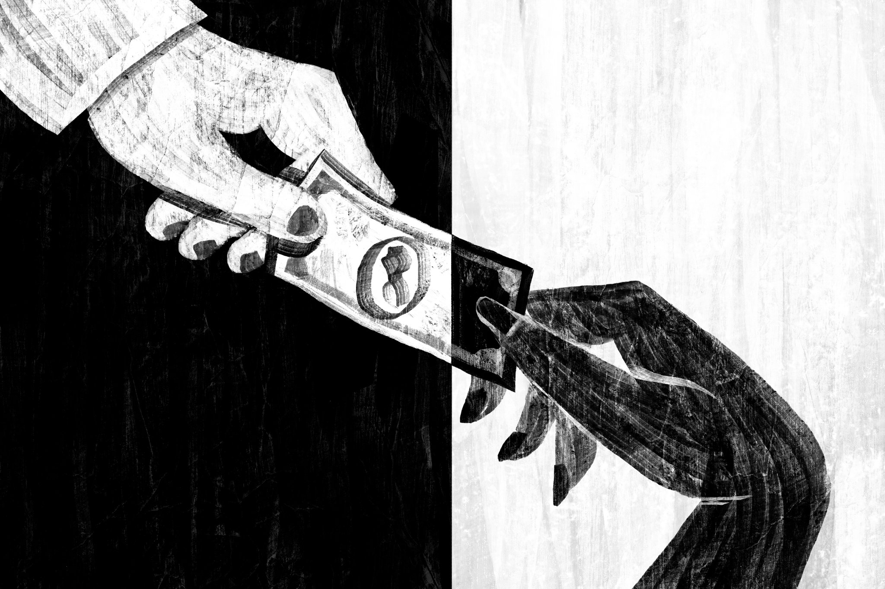
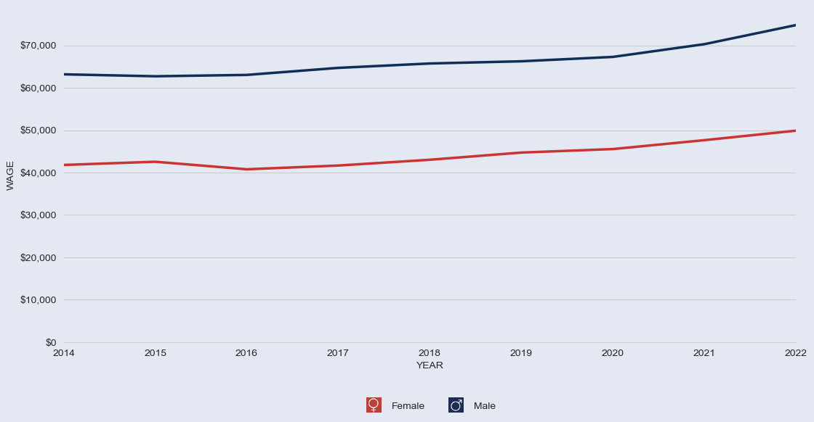
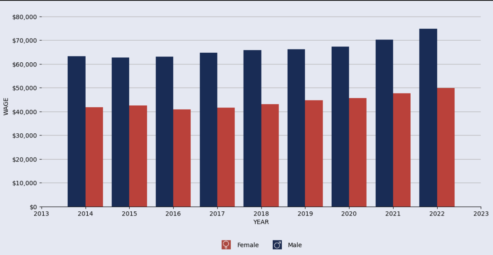
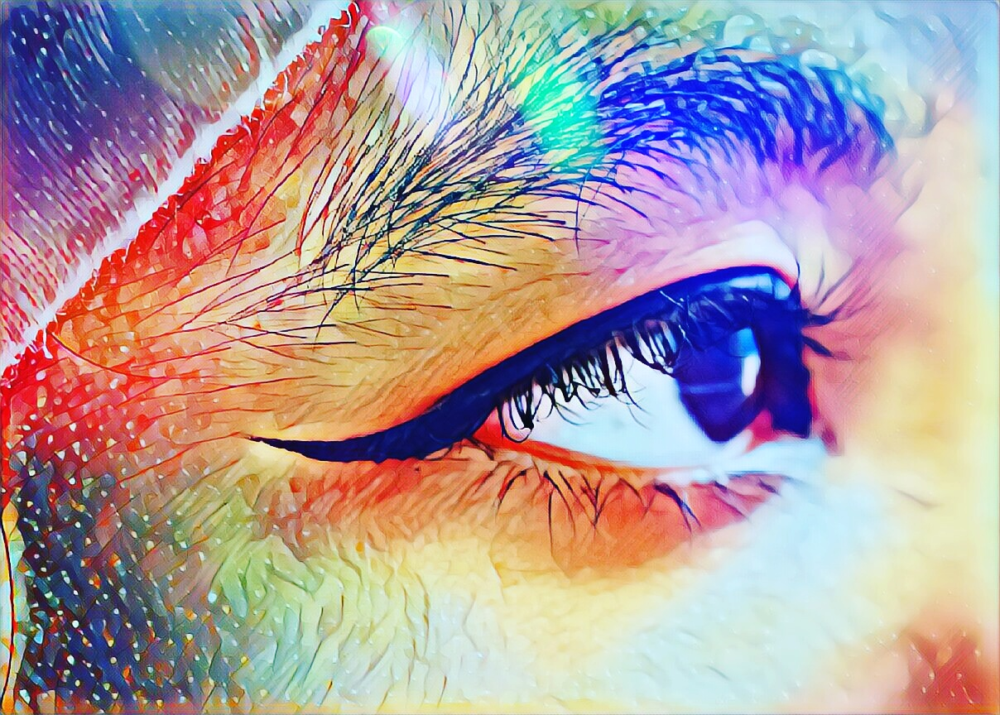
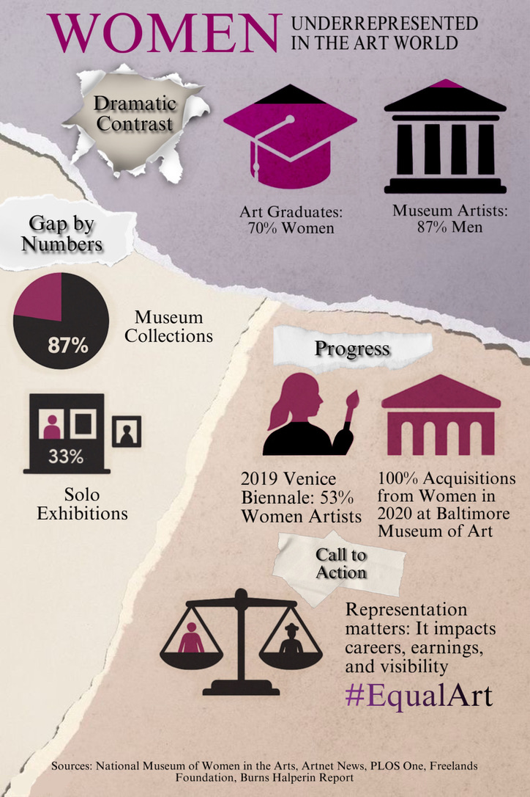
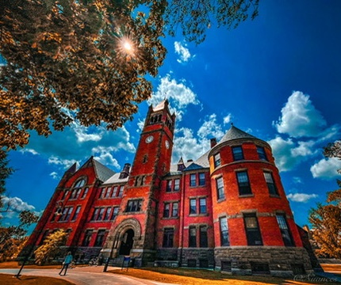
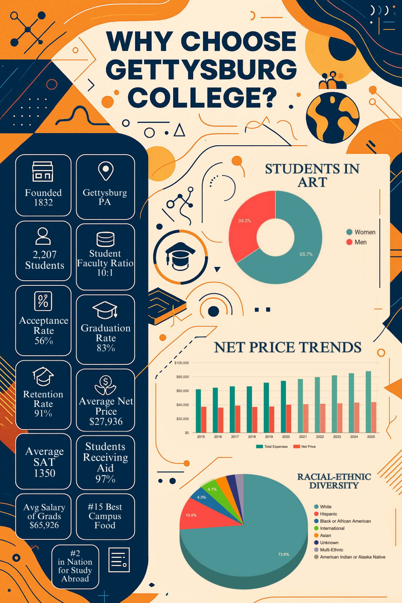

# Data Visualization Portfolio #

Welcome! I'm Nafisul Hasan Sami — a Math and Art major passionate about exploring how creativity and technology intersect to drive innovation.

At the crossroads of creativity and technology, I’m a Math and Art major passionate about exploring how these worlds intersect to drive innovation. Mathematics sharpens my analytical thinking, while my lifelong love for art fuels my creativity, whether I’m designing digital artwork, diving into programming, or strategizing in a competitive game. Curiosity, adaptability, and a sense of humor are at the core of who I am. I approach challenges with precision and creativity, finding unique solutions and enjoying the process along the way. My interests span the impact of technology on art, the strategic depth of gaming, and the power of humor to connect with others. I believe that meaningful work comes from blending intellect, creativity, and human connection. With these values in mind, I’m excited to continue learning, innovating, and shaping a future where art and technology come together to inspire.

Here, you'll find a collection of projects showcasing my skills in data analysis and visualization. I am passionate about turning data into meaningful insights and compelling visuals.

To learn more about me, you can visit:

- [My Website](https://nuancesbynafis.com)
- [My GitHub](https://github.com/naf1ss)
- [My Resume](Resume.pdf)
- [Photography](https://www.instagram.com/nuancesbynafis/)

---

## 🎭 Project 1: Gender Wage Trends in Art Professions (2014–2022)

**Goal:** Explore wage trends among male and female professionals in art-related fields over time and highlight the gender wage gap more clearly. 

**Motivation:** The original line chart (from DataUSA) effectively displayed trends but did not emphasize the wage disparity between genders. This project remixes the visualization to offer clearer comparisons. 

**Tools:** Python, Plotly

---

### 🔁 Remix Summary

I transformed the original line graph into a grouped bar chart to improve clarity in year-by-year wage comparisons. This format allows viewers to immediately grasp differences in wages between men and women in artistic occupations.

---

### 🎨 Design Decisions

- **Chart Type:** Converted from a line graph to a grouped bar chart 
- **Color Scheme:** Maintained original colors for gender — blue (#122D58) for males, red (#CA3433) for females 
- **Background & Aesthetics:** Preserved the original background color (#E4E8F3) and overall visual structure 
- **Axis Formatting:** Applied currency formatting to improve readability 
- **Legend & Layout:** Retained familiar placements and grid for viewer continuity

---

### 📊 Final Visualization

*Recreate*

*Remix: Grouped bar chart showing gender wage trends in art professions*

### 📁 Files

- 📓 [Code](Project1/DS311_RecreateRemix/Recreate.ipynb)
- 📄 [Report (Google Drive)](https://drive.google.com/file/d/1U16qUJi2muKRY6udXty72g4gZieJKR-Y/view?usp=drivesdk)

---

### 🌐 Data Source

- [DataUSA – Artists & Related Workers (with gender comparison)](https://datausa.io/profile/soc/artists-related-workers?compare=computer-mathematical-occupations&employment-measures=avgWageEOT&compare_employment-measures=avgWageEOT)

---

### 🤖 Citations

- GitHub Copilot — Assisted with bar chart implementation 
- ChatGPT — Helped brainstorm remix ideas and troubleshoot coding logic

---

## 🖼️ Project 2: Women Artists Remain Underrepresented in the Art World

 

**Goal:** Use visual storytelling to highlight how women, despite being the majority of art school graduates, remain drastically underrepresented in museum collections, exhibitions, and the art market. 

**Motivation:** This project addresses a persistent gender gap in the art world using data-driven design and compelling visual contrasts. 

**Tools:** Python (data prep), Research Synthesis, Procreate, Picsart

---

### 📊 Project Summary

The infographic is organized into four panels:

1. **Introduction – A Dramatic Contrast:** 
  Introduces the disparity — women earn ~70% of fine arts degrees but are only ~13% of museum collections.
2. **By the Numbers – The Gender Gap:** 
  Shows the wide gender gap across museum collections, gallery representation, exhibitions, and market sales.
3. **Spotlight on Progress – Signs of Change:** 
  Highlights positive institutional efforts, exhibitions achieving parity, and leadership shifts.
4. **Call to Action – Balancing the Scales:** 
  Encourages viewers to support equity by promoting women artists and holding institutions accountable.

---

### 🎨 Design Highlights

- Organized as a 4-panel infographic with a clear thesis and storytelling flow 
- Uses dramatic statistics and international comparisons for impact 
- Color and layout guide the viewer visually and emotionally from issue to action 
- Final panel inspires participation and institutional change

---

### 📊 Final Visualization

--- 

### 📁 Files

 
- 📁 [Report (Google Drive)](https://drive.google.com/file/d/1PGPeEgvyduiUrptuVL83wu7FGRGxC1la/view?usp=sharing)

---

### 🌐 Data Sources

- [National Museum of Women in the Arts: Get the Facts](https://nmwa.org/support/advocacy/get-facts/)
- [Burns Halperin Report (Artnet News, 2022)](https://news.artnet.com/art-world/letter-from-the-editors-introducing-the-2022-burns-halperin-report-2227445)
- [UNESCO Courier – Women Enter the Picture](https://courier.unesco.org/en/articles/women-enter-picture)
- [Gendered Prices – The Review of Financial Studies (Oxford)](https://academic.oup.com/rfs/article/34/8/3789/6218783)
- [Hyperallergic – Art by Women Study](https://hyperallergic.com/417356/art-by-women-gender-study-sexism/)

---

### 🤖 Citations

- ChatGPT – Assisted in brainstorming structure and identifying high-impact data storytelling techniques

---

## 🏫 Project 3: Why Choose Gettysburg College?

**Goal:** Present a data-driven snapshot of Gettysburg College to highlight its academic value, affordability, diversity, and student success.

**Motivation:** While colleges often promote themselves with anecdotal or generic content, this project uses publicly available data to make an evidence-based case for why Gettysburg is a strong liberal arts institution. As a student myself, I wanted to showcase our college’s strengths visually and persuasively.

**Tools:** Procreate, Picsart

---

### 🔁 Remix Summary

I compiled and reworked visual elements sourced from the IPEDS federal database and College Factual into a unified, branded infographic. This included modifying bar charts, creating new donut charts for racial/ethnic and arts major breakdowns, and re-coloring all visuals in Gettysburg’s signature palette.

---

### 🎨 Design Decisions

- **Color Scheme:** Gettysburg College’s brand colors — navy blue (#002855), orange (#F26F21), and neutral grays  
- **Layout:** Multi-section horizontal structure to mimic a digital brochure  
- **Typography:** Strong headings with readable body text; fonts chosen to mirror Gettysburg marketing materials  
- **Icons & Imagery:** Used academic and community icons (graduation caps, globe, people, charts) for visual readability  
- **Chart Restyling:** Original IPEDS bar and pie charts were recreated in cleaner, more thematic formats with simplified labels and legends

---

### 📊 Final Visualization

 
*Gettysburg College Infographic*

---

### 📁 Files

- 🌐 [Report (Google Drive)](https://drive.google.com/file/d/1mRG9we8EjRArsFWugTmsDzTt3BXqc0QY/view?usp=sharing)
---

### 🌐 Data Sources

- [IPEDS – Gettysburg College Profile](https://nces.ed.gov/ipeds/institution-profile/212674)  
- [College Factual – Visual & Performing Arts at Gettysburg](https://www.collegefactual.com/colleges/gettysburg-college/academic-life/academic-majors/visual-and-performing-arts)
- [Gettysburg College Website](https://www.gettysburg.edu)

---

### 🤖 Citations

- **ChatGPT** — Helped draft report, refine captions, and plan infographic structure  
- **Gettysburg.edu** — For key statistics, structure, and student life reference points

